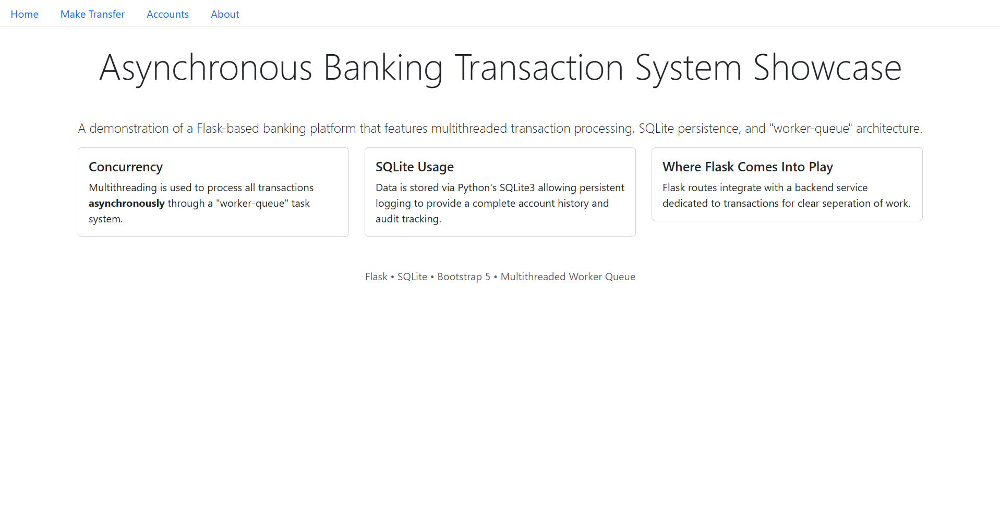
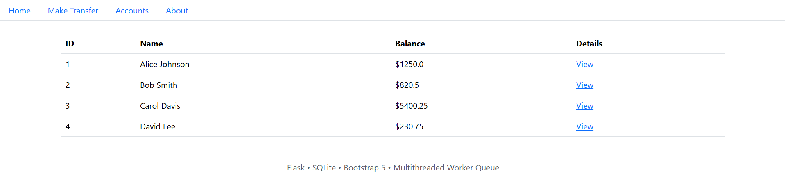
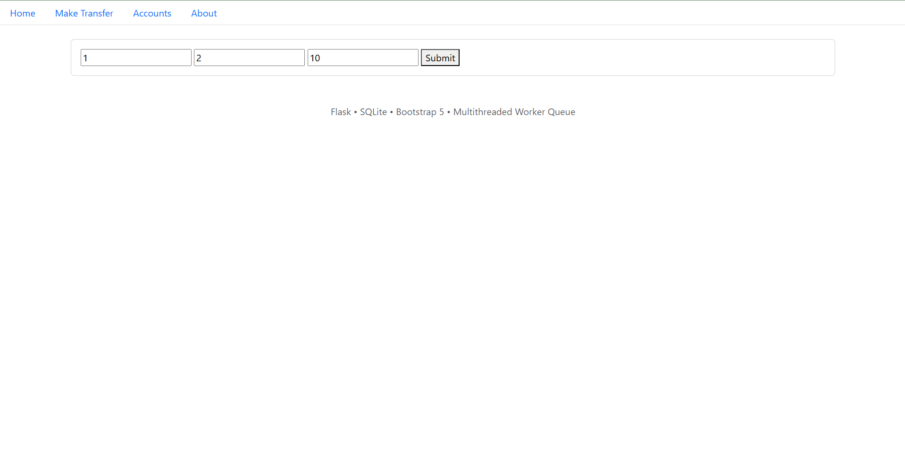
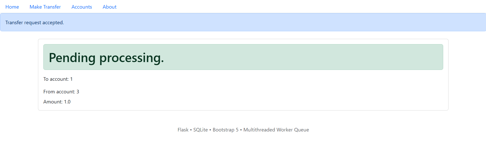
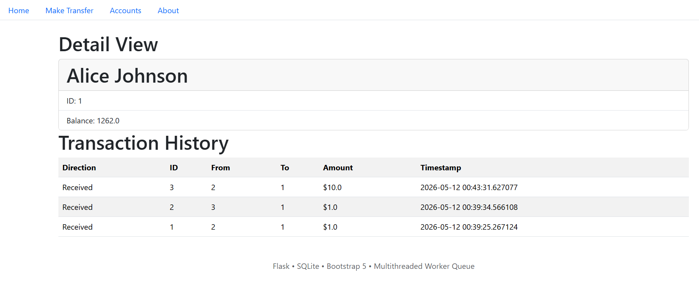

# Full-stack Flask Asynchronous Banking Transaction Demo
Live Demo: [Click Here](https://asyncflaskbankdemo.onrender.com)

This full-stack Flask application features a dedicated backend service to asynchronously process transactions and is routed using Flask and Jinja2 templates to showcase a clean and responsive Bootstrap5 HTML frontend. 

## How to Run
1. Clone repository  
```git clone https://github.com/mchenrep/fullstackflaskapp```  
2. Create virtual environment and install all dependencies from requirements.txt  
```pip install requirements.txt```
3. Initialize database and seed it  
```python .\schema.py```  
```python .\seed.py```  
4. Run the Flask app  
```python .\app.py```

## Screenshots
Home:  
  

Accounts:  
  

Transfer:  



Account Details:  
  

## Features
- Asynchronous transaction processing  
- Worker thread queue system  
- Account lookup and transaction history  
- Basic transaction validation  
- Flask/Jinja2 Frontend  
- Bootstrap5 Responsive UI  
- SQLite persistence  

## System Design
The request flow looks something like:  
```
Flask recieves request for transfer and validates input -> request gets added to queue -> worker thread processes transaction (further validation occurs) -> SQLite database gets updated -> transaction history and account details reflected in UI   
```

## Technology Used
Backend:  
- Python  
- Flask  
- SQLite  
- threading (Thread, Lock), queue (Queue)  
  
Frontend:  
- HTML  
- Jinja2  
- Bootstrap 5  

## Database Design
There are 2 tables, accounts and transactions.  

Accounts:
- id
- name
- balance

Transactions:
- id
- to account
- from account
- amount
- timestamp

## Limitations/Simplified Deployment Build
Some limitations faced during this project include an in-memory queue, using SQLite as a database (inefficient for high concurrency), and clashing between the deployment environment and the backend service. Because this is only a demo, I chose to use SQLite and an in-memory queue which was unable to be deployed in Render's stateless multiprocess environment, that is why the demo deployed on Render uses a serialized (sychronous) transaction system instead. In retrospect, I would have implemented a persistent queue system (something disk safe like Redis) and migrated my database to another relational one known for high concurrency like Postgres or MySQL. 
  
## Future Improvements
If I were to improve this project for the future, here are a list of things I would implement:  
1. Persistent queue system  
2. Migration to a server database (such as PostgresSQL)
3. Transaction status tracking  
4. Authentication system + log in 
