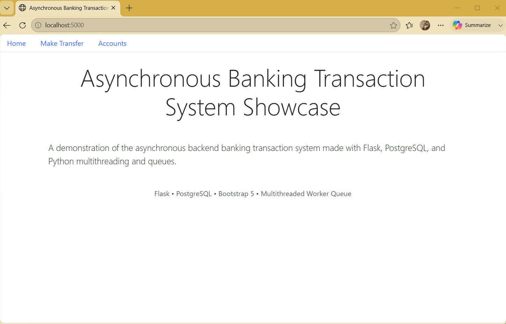
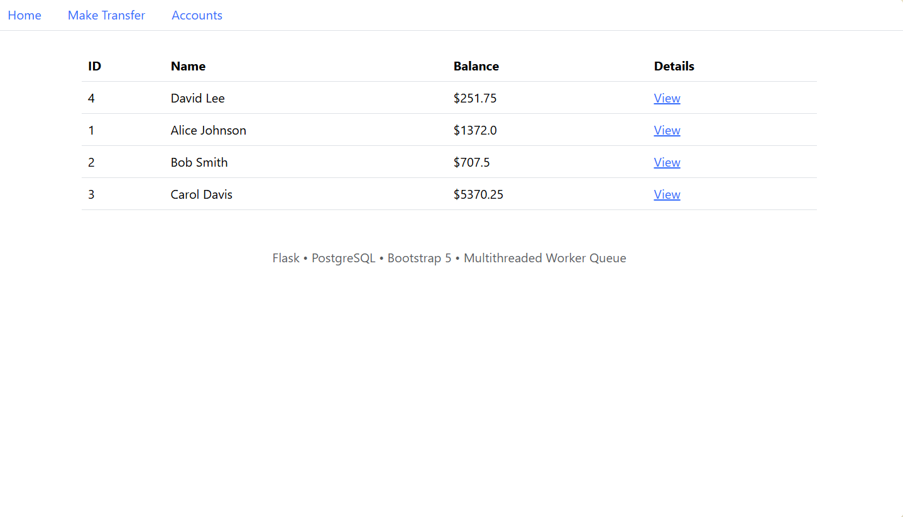
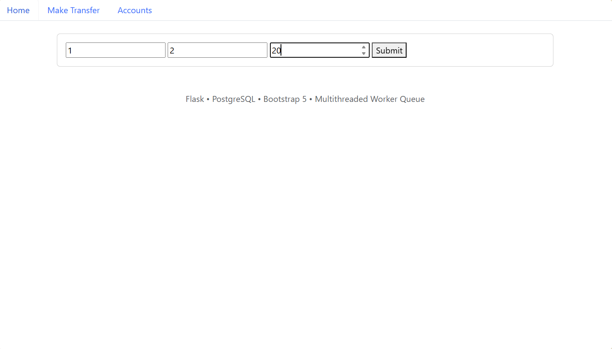
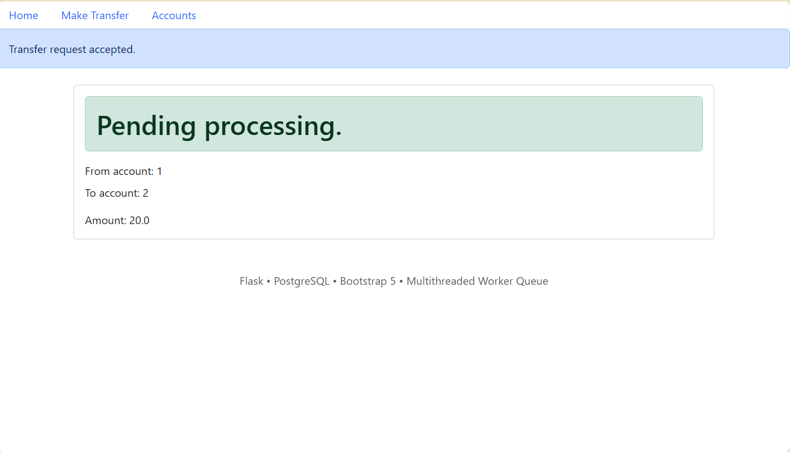
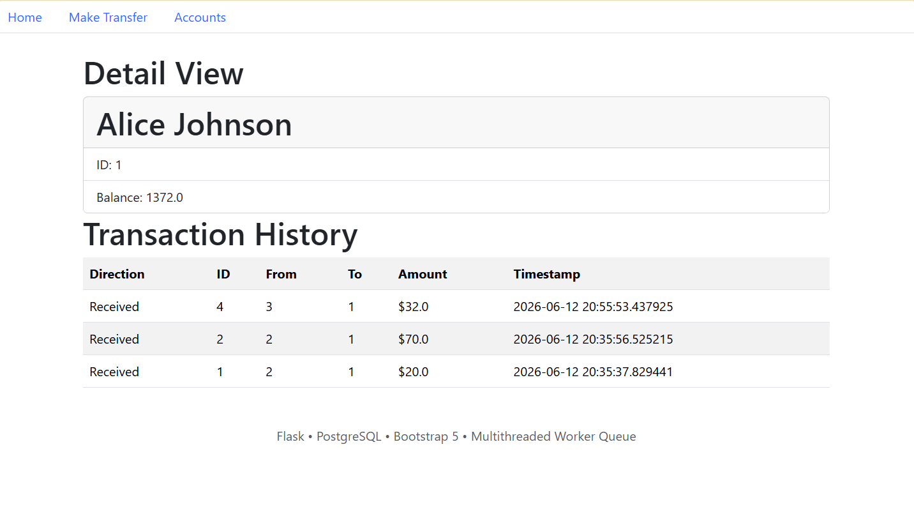

# Full-stack Flask Asynchronous Banking Transaction Demo
Live Demo: [Click Here](https://asyncflaskbankdemo.onrender.com)

This full-stack Flask application features a dedicated backend service to asynchronously process transactions and is routed using Flask and Jinja2 templates to showcase a clean and responsive Bootstrap5 HTML frontend. 

## How to Run
1. Clone the repository
```git clone https://github.com/mchenrep/fullstackflaskapp.git```
2. Build the Docker container(s)
```docker compose up --build```
3. Access the application
```http://localhost:5000```
4. Close the application (remove Docker container(s))
```docker compose down```


## Screenshots
Home:  
  

Accounts:  
  

Transfer:  



Account Details:  
  


## Technology Used
Backend:  
- Python  
- Flask  
- PostgreSQL 
- threading (Thread, Lock), queue (Queue)  
  
Frontend:  
- HTML  
- Jinja2  
- Bootstrap 5  

Containerization:
- Docker

## Database Design
There are 2 tables, accounts and transactions.  

Accounts:
- id (PK)
- name
- balance

Transactions:
- id (PK)
- to account
- from account
- amount
- timestamp

  
## Future Improvements
If I were to improve this project for the future, here are a list of things I would implement:  
1. Transaction status tracking  
2. Authentication system/login 
3. Deployment to cloud service
